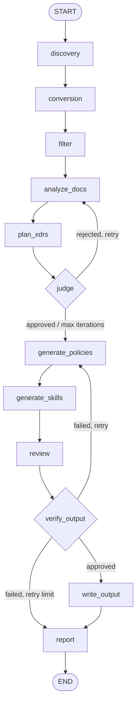

# xdrs-compiler

Compiles a folder of documents into [XDRS](https://github.com/flaviostutz/xdrs) policy and skill files that LLMs can consume as structured context.

## Getting Started

```sh
# Install and run with uvx (no install required)
uvx xdrs-compiler --input-dir ./docs --xdrs-root .xdrs --scope myteam
```

This saves a `.xdrs-compiler.yml` config file and runs the full pipeline. On subsequent runs:

```sh
uvx xdrs-compiler          # reads .xdrs-compiler.yml, re-runs automatically
```

### Prerequisites

An OpenAI API key is required:

```sh
export OPENAI_API_KEY=sk-...
```

---

## Configuration

Running with `--input-dir`, `--xdrs-root`, and `--scope` saves `.xdrs-compiler.yml`. You can also create or edit it manually:

```yaml
# .xdrs-compiler.yml
input_dir: ./docs        # required — directory containing source documents
xdrs_root: .xdrs         # required — root directory for XDRS output
scope: myteam            # required — XDRS scope name for generated elements
model: gpt-4o-mini       # optional — OpenAI model (default: gpt-4o-mini)
work_dir: .work          # optional — intermediate files directory (default: .work)
```

All CLI flags:

| Flag | Description |
|---|---|
| `--input-dir` | Source documents directory |
| `--xdrs-root` | XDRS output root (e.g. `.xdrs`) |
| `--scope` | XDRS scope name |
| `--model` | OpenAI model override (per-run, not saved) |
| `--work-dir` | Working directory override (per-run, not saved) |
| `--config` | Config file path (default: `.xdrs-compiler.yml`) |

---

## How it works

The compiler runs a 4-phase [LangGraph](https://github.com/langchain-ai/langgraph) agent pipeline:



### Phase 1 — Preparation

| Node | What it does |
|---|---|
| **discovery** | Finds all supported files under `input_dir` (`.md`, `.pdf`, `.docx`, `.pptx`, `.xlsx`, `.html`, `.htm`, `.txt`, `.yaml`, `.yml`, `.json`, `.csv`, `.epub`, `.xml`, `.msg`) |
| **conversion** | Converts each file to Markdown with [markitdown](https://github.com/microsoft/markitdown); writes `{work_dir}/{rel_path}.md` (1:1 source traceability) |
| **filter** | Drops converted files with fewer than 10 words |

### Phase 2 — Analysis (with judge loop)

| Node | What it does |
|---|---|
| **analyze_docs** | LLM extracts `date`, `abstract`, and candidate `topic_policies` / `topic_skills` per document |
| **plan_xdrs** | LLM aggregates all per-doc analysis into a deduplicated `ProposalsMap` (proposed policies + skills with related source paths) |
| **judge** | LLM evaluates the proposals against 7 XDRS quality criteria (usefulness, scope, no duplicates, focus, source relevance, full coverage, traceability). If rejected, feeds back specific guidance and loops to **analyze_docs**. Capped at **2 iterations**. |

**Judge criteria:**
1. Usefulness — reusable organizational knowledge, not one-off specifics
2. Defined scope — each document covers one well-bounded topic
3. No duplicates — overlapping topics are merged
4. Focus — not too broad or too diverse
5. Source relevance — `related_docs` actually relate to the proposed document
6. Full coverage — no important source information is omitted
7. Source traceability — every proposal has at least one `related_doc`

### Phase 3 — Synthesis

| Node | What it does |
|---|---|
| **generate_policies** | LLM writes each approved policy proposal as a complete XDRS Policy `.md` |
| **generate_skills** | LLM writes each approved skill proposal as a complete XDRS `SKILL.md` |
| **review** | LLM reviews and patches each generated document against XDRS formatting standards |
| **verify_output** | Dedicated verification node decides whether reviewed documents are safe to write or must be regenerated |
| **write_output** | Saves reviewed documents to `{xdrs_root}/{scope}/` |

### Phase 4 — Report

| Node | What it does |
|---|---|
| **report** | Writes `.xdrs-compiler.report` (JSON) mapping each output file path to its source documents |

---

## Output

Generated files land under `{xdrs_root}/{scope}/`:

```
.xdrs/
  myteam/
    adrs/
      application/
        001-call-center-behavior.md
        002-production-deployment-requirements.md
    edrs/
      application/
        skills/
          001-call-handling-procedure/
            SKILL.md
```

The report file `.xdrs-compiler.report` maps each output to its source documents:

```json
{
  ".xdrs/myteam/adrs/application/001-call-center-behavior.md": {
    "related_input_files": [
      "docs/2021/call-center-presentation.pdf",
      "docs/emails/customer-service-memo.txt"
    ]
  }
}
```

---

## Incremental compilation

A content-hash manifest (`{work_dir}/.xdrs-compiler-manifest.json`) tracks each source file. On each run:

- **Nothing changed** → pipeline is skipped entirely; all files reported as `skipped`
- **Any file changed** → full pipeline re-runs

```sh
# First run
compiled=2 skipped=0 errors=0

# Second run — nothing changed
compiled=0 skipped=3 errors=0

# After editing one source doc
compiled=2 skipped=0 errors=0
```

---

## Examples

### Scenario 1: Call center knowledge base

```sh
uvx xdrs-compiler \
  --input-dir ./call-center-docs \
  --xdrs-root .xdrs \
  --scope operations
```

Input: PDFs, PPTs, Word docs  
Output: `001-customer-interaction-standards.md`, `002-escalation-policy.md`, `SKILL.md` for call procedures

### Scenario 2: Compliance and regulations

```sh
uvx xdrs-compiler \
  --input-dir ./legal/memos \
  --xdrs-root .xdrs \
  --scope compliance
```

Input: email threads (`.txt`), Word memos (`.docx`), PDF notices  
Output: policies per regulatory requirement with full source traceability in the report

### Scenario 3: Mixed engineering documentation

```sh
uvx xdrs-compiler \
  --input-dir ./engineering-wiki \
  --xdrs-root .xdrs \
  --scope platform \
  --model gpt-4o
```

Input: Confluence HTML exports, runbooks (`.md`), spreadsheets (`.xlsx`)  
Output: deployment policies, incident response skills, infrastructure constraints

---

## Development

```sh
cd xdrs-compiler/lib

make setup      # install dependencies
make test       # run tests with coverage report
make lint       # ruff + pyright + pip-audit
make lint-fix   # auto-fix formatting and lint issues
make build      # build distributable wheel
```

### Project structure

```
src/xdrs_compiler/
  __init__.py         # public API
  __main__.py         # CLI entry point
  config.py           # CompilerConfig dataclass + YAML I/O
  compiler.py         # Compiler class (incremental + pipeline orchestration)
  pipeline/
    state.py          # CompilerState TypedDict + Pydantic models
    preparation.py    # Phase 1: discovery, conversion, filter
    analysis.py       # Phase 2: analyze_docs, plan_xdrs
    synthesis.py      # Phase 3: generate_policies, generate_skills, review, write_output
    report.py         # Phase 4: report
    graph.py          # build_graph() — assembles the full LangGraph pipeline
```

### Python API

```python
from xdrs_compiler import Compiler, CompilerConfig

config = CompilerConfig(
    input_dir="./docs",
    xdrs_root=".xdrs",
    scope="myteam",
    model="gpt-4o-mini",
)
result = Compiler(config).compile()
print(result.summary())   # compiled=3 skipped=0 errors=0
assert result.success
```
